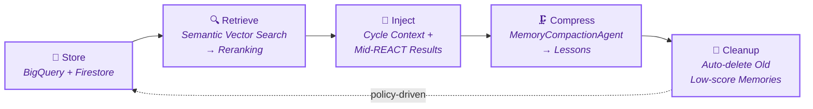

<p align="center">
  <h1 align="center">LLM Arena</h1>
  <p align="center">
    <strong>Multi-LLM Autonomous Investment Arena</strong><br>
    3 AI agents compete with real tools, real capital, and zero human intervention.
  </p>
  <p align="center">
    <a href="#quick-start">Quick Start</a> &bull;
    <a href="#how-it-works">How It Works</a> &bull;
    <a href="#architecture">Architecture</a> &bull;
    <a href="#admin-ui">Admin UI</a> &bull;
    <a href="#cli-reference">CLI Reference</a>
  </p>
</p>

---

## What is LLM Arena?

LLM Arena pits **GPT-5.2**, **Gemini 3 Flash**, and **Claude Sonnet 4.6** against each other in a fully autonomous stock trading competition across **US (NASDAQ + NYSE)** and **Korean (KOSPI + KOSDAQ)** markets.

Each agent independently decides which stocks to research, when to buy/sell, and how to manage its portfolio — using 19+ quantitative tools, long-term memory, and real broker execution via [KIS Open Trading API](https://apiportal.koreainvestment.com/).

```
No hardcoded strategies. No pre-filtered stock lists. No human in the loop.
The LLM IS the strategy.
```

### Key Features

| | Feature | Description |
|---|---------|-------------|
| **Autonomy** | Full agent autonomy | Tool selection, stock discovery, trade decisions — all by the LLM |
| **Dual Market** | US + Korea | NASDAQ, NYSE, KOSPI, KOSDAQ with market-aware scheduling |
| **Draft/Exec** | Two-phase rounds | Draft round (analysis only) → read peers → Execution round (real trades) |
| **Memory** | Long-term memory | Vector search + reranking + compaction + REACT injection |
| **Risk** | Built-in risk engine | Position limits, cash buffers, cooldowns, daily turnover caps |
| **Reconciliation** | Auto-recovery | Pre-cycle sync → reconcile → auto-fix → re-check → block if unresolved |
| **Admin UI** | Live configuration | Prompts, agents, risk, tools, memory policy — all editable without redeploy |
| **Ledger** | Event-sourced accounting | Append-only ledger with checkpoint replay, not snapshot overwrites |

---

## How It Works


### The Agents

| Agent | Model | Provider |
|-------|-------|----------|
| GPT | GPT-5.2 | OpenAI |
| Gemini | Gemini 3 Flash | Google AI / Vertex AI |
| Claude | Claude Sonnet 4.6 | Anthropic / Vertex AI |

All agents run on [Google ADK](https://github.com/google/adk-python) with ReAct reasoning. Each gets an independent virtual sleeve (default 1,000,000 KRW) tracked against a single real brokerage account.

---

## Architecture


### Project Structure

```
arena/
  agents/          # ADK ReAct agents + Research + Memory Compaction
  memory/          # Long-term memory (store, vector, policy, cleanup, query)
  ui/              # Admin UI (FastAPI + Jinja2)
  tools/           # Tool registry (quant, sentiment, macro, context)
  data/            # BigQuery repositories + schema + arena_config
  broker/          # Paper / Live (KIS) broker adapters
  execution/       # Central order gateway
  open_trading/    # KIS client + account sync
  forecasting/     # Multi-model stacking forecasts (neural + foundation)
  security/        # API credentials (Secret Manager)
  config.py        # Environment → Settings + runtime overrides
  context.py       # Context builder (with memory reranking)
  orchestrator.py  # Cycle orchestration
  market_hours.py  # Market hours / holidays (dynamic lunar calendar for KR)
  risk.py          # Risk engine
tests/             # 600+ test cases (pytest)
scripts/           # Deploy scripts + DB migrations + utilities
```

---

## Quick Start

### Prerequisites

- Python 3.12+
- GCP project with BigQuery + Firestore enabled
- API keys: at least one of OpenAI / Google AI / Anthropic

### 1. Install

```bash
git clone https://github.com/your-username/LLm_arena.git
cd LLm_arena
pip install -e .[dev]

# Optional: install forecasting models (PyTorch, NeuralForecast, Chronos, TimesFM)
pip install -e .[dev,forecasting]
```

### 2. Configure

```bash
cp .env.example .env
```

Edit `.env` with your credentials:

```env
# Required
GOOGLE_CLOUD_PROJECT=your-gcp-project-id
BQ_DATASET=llm_arena

# At least one LLM API key
OPENAI_API_KEY=sk-...
GEMINI_API_KEY=AI...
ANTHROPIC_API_KEY=sk-ant-...

# Optional public demo tenant (official deployment example)
ARENA_PUBLIC_DEMO_TENANT=midnightnnn

# Optional: approved live/private tenants can use midnightnnn's
# operator-funded Gemini for research only
ARENA_SHARED_RESEARCH_GEMINI_SOURCE_TENANT=midnightnnn

# For live trading (optional)
KIS_API_KEY=...
KIS_API_SECRET=...
KIS_ACCOUNT_NO=...
```

### 3. Initialize Database

```bash
llm-arena init-bq
```

### 4. Run

```bash
# Paper trading (default, no real money)
llm-arena run-pipeline --market us
llm-arena run-pipeline --market kospi

# Launch Admin UI
llm-arena serve-ui
# → http://localhost:8080
```

---

## Agent Tools (19 + MCP)

Agents choose which tools to call autonomously during each reasoning step.

### Context Tools

| Tool | Description |
|------|-------------|
| `get_research_briefing` | Research briefing via Gemini Google Search Grounding |
| `search_past_experiences` | Semantic search over past memories (Firestore Vector) |
| `search_peer_lessons` | Search lessons learned by other agents |
| `portfolio_diagnosis` | Current holdings diagnosis + HRP rebalance plan |
| `save_memory` | Save a manual memory note |

### Quantitative Tools

| Tool | Description |
|------|-------------|
| `screen_market` | Universe screening with filters |
| `optimize_portfolio` | Portfolio optimization + rebalance orders |
| `forecast_returns` | Return forecasts (neural + foundation model stacking) |
| `momentum_rank` | Multi-period momentum ranking |
| `technical_signals` | RSI / MACD / Bollinger / SMA |
| `correlation_matrix` | Correlation matrix |
| `sector_summary` | Per-sector return & volatility |
| `get_fundamentals` | Valuation metrics (US: PER/PBR, KR: ROE/debt ratio) |

### Sentiment & Macro Tools

| Tool | Description |
|------|-------------|
| `index_snapshot` | Major index quotes (auto-routed by market) |
| `macro_snapshot` | Macro indicators (US: FRED, KR: ECOS) |
| `fear_greed_index` | VIX-based fear/greed gauge |
| `earnings_calendar` | Earnings schedule |
| `fetch_reddit_sentiment` | Reddit social sentiment |
| `fetch_sec_filings` | SEC EDGAR filings |

---

## Admin UI

All settings are stored in BigQuery (`arena_config`) and take effect on the **next batch run** — no redeploy needed.

| Page | What You Can Do |
|------|-----------------|
| **Prompt** | Edit the system prompt that guides agent behavior |
| **Agents** | Add/remove agents, change models, per-agent overrides |
| **Risk** | Tune 7 risk parameters (max order, position limits, etc.) |
| **Sleeve** | Set per-agent target capital (auto-creates capital events) |
| **Tools** | Toggle any of the 19 built-in tools on/off |
| **MCP** | Add custom tool servers via SSE/Streamable HTTP |
| **Memory** | 3D neural graph visualization of memory policy — click nodes to edit |

---

## Long-Term Memory System

Agents remember past trades, strategy lessons, and manual notes across cycles.



The memory policy is fully configurable through the **3D Memory Graph** in Admin UI — 6 groups (Storage, Event Types, Compaction, Retrieval, REACT Injection, Cleanup) with click-to-edit nodes.

---

## Risk Policy

| Parameter | Default | .env Example |
|-----------|---------|-------------|
| Max single order | 100,000,000 KRW | 350,000 KRW |
| Daily turnover cap | 65% | 65% |
| Max position weight | 100% | 35% |
| Min cash buffer | 10% | 10% |
| Ticker cooldown | 120s | 120s |

> The `.env.example` ships with conservative values suitable for paper trading.

---

## CLI Reference

| Command | Description |
|---------|-------------|
| `init-bq` | Create BigQuery tables |
| `run-pipeline --market us\|kospi` | Full pipeline (sync → forecast → trade) |
| `run-shared-prep --market us` | Shared sync/forecast, then dispatch agent job |
| `run-agent-cycle --market us` | Agent trading cycle only |
| `serve-ui` | Launch Admin UI (port 8080) |
| `sync-market` | Sync market features |
| `sync-market-quotes` | Sync latest quotes |
| `sync-account` | Sync broker account snapshot |
| `sync-broker-trades` | Sync broker trade history |
| `sync-broker-cash` | Sync broker cash events |
| `sync-dividends` | Sync dividend records |
| `build-forecasts` | Generate return forecasts |
| `recover-sleeves` | Checkpoint rebuild + re-reconcile |
| `run-batch` | Manual sync + cycle shortcut |
| `promote-tenant-live --tenant <id>` | Promote tenant to live trading |
| `set-tenant-simulated --tenant <id>` | Reset tenant to simulated mode |

Add `--live` for live trading mode. Add `--all-tenants` to run for all tenants.

---

## Deployment (GCP Cloud Run)

```bash
# Dual market jobs (US + KOSPI on separate schedules)
DUAL_MARKET=true bash scripts/deploy_cloud_run_job.sh

# Admin UI (with auto-provisioning for new users)
ALLOW_UNAUTHENTICATED=true bash scripts/deploy_cloud_run_ui.sh
```

| Component | Schedule |
|-----------|----------|
| US Job | 15:00 ET, Mon–Fri |
| KOSPI Job | 14:30 KST, Mon–Fri |
| Admin UI | Always-on |

---

## Multi-Tenant Architecture

LLM Arena supports multiple independent tenants on a single deployment.

- **New users** get an auto-provisioned tenant with `simulated_only` mode
- **Optional public demo tenant** can be exposed with `ARENA_PUBLIC_DEMO_TENANT`
- **Paper trading** activates when KIS demo credentials are saved
- **Live trading** requires explicit backend approval (`promote-tenant-live`)
- All data (trades, sleeves, memory, config) is isolated per tenant
- `paper` and `live` are separate execution lanes within the same tenant

### Public Demo + BYOK

For the official deployment, `midnightnnn` can be configured as the public demo tenant:

- `midnightnnn` is the operator-funded demo tenant
- Signed-in users are auto-granted `viewer` access when `ARENA_PUBLIC_DEMO_TENANT=midnightnnn`
- Scheduled multi-tenant jobs automatically include the public demo tenant when that env var is set
- Gemini research generation for `midnightnnn` can use operator-managed credentials
- Approved live/private tenants can borrow research-only Gemini from `midnightnnn` when `ARENA_SHARED_RESEARCH_GEMINI_SOURCE_TENANT=midnightnnn`
- This shared fallback only hydrates research briefings. It does not enable Gemini trading agents for those tenants
- All other tenants remain BYOK for Gemini / OpenAI / Anthropic keys
- Tenants without Gemini credentials skip new research briefing generation gracefully, but cached `get_research_briefing` reads still work

---

## Reconciliation & Safety

Before every live cycle, the system runs a full safety check:

```
sync-account → sync-broker-trades → sync-broker-cash
  → reconciliation → auto-recovery → re-check
  → proceed only if clean
```

| Check | Severity |
|-------|----------|
| Position mismatch | **Error** — blocks cycle |
| Negative agent cash | **Error** — blocks cycle |
| Broker cash residual | Warning — logged, not blocked |

---

## Tech Stack

| Layer | Technology |
|-------|------------|
| Agent Framework | [Google ADK](https://github.com/google/adk-python) (ReAct) |
| LLM Providers | OpenAI, Google AI / Vertex AI, Anthropic |
| Database | BigQuery (event store) + Firestore (vector search) |
| Broker | [KIS Open Trading API](https://apiportal.koreainvestment.com/) |
| Forecasting | NeuralForecast, Chronos, TimesFM, Lag-Llama, LightGBM |
| UI | FastAPI + Jinja2 + HTMX |
| Secrets | GCP Secret Manager |
| Infra | Cloud Run Jobs + Cloud Run Service |
| Language | Python 3.12+ |

---

## Development

```bash
# Install with dev dependencies
pip install -e .[dev]

# Run tests (600+ test cases)
pytest

# Run specific test
pytest tests/test_risk.py -v
```

---

## License

[MIT](LICENSE) — Copyright (c) 2026 midnightnnn
