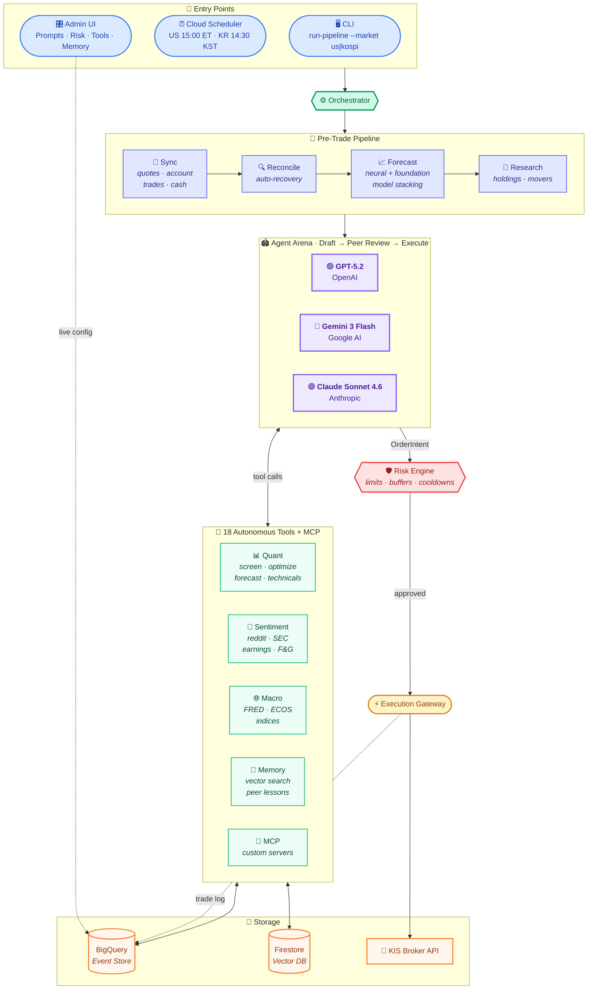
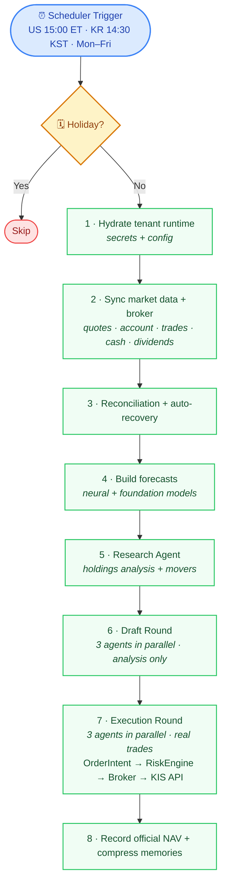
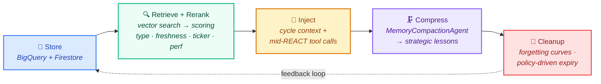

<p align="center">
  <h1 align="center">🏟️ LLM Arena</h1>
  <p align="center">
    <b>Multi-LLM Autonomous Investment Arena</b><br>
    3 AI agents compete with real money, real tools, and zero human intervention.
  </p>
  <p align="center">
    
    
    
    
  </p>
  <p align="center">
    <a href="#quick-start">Quick Start</a> ·
    <a href="#architecture">Architecture</a> ·
    <a href="#how-it-works">How It Works</a> ·
    <a href="#admin-ui">Admin UI</a> ·
    <a href="#cli-reference">CLI</a>
  </p>
</p>

---

> **GPT-5.2** vs **Gemini 3 Flash** vs **Claude Sonnet 4.6** — each agent independently discovers stocks,
> builds conviction, and executes real trades across **US + Korean markets**.
> No hardcoded strategies. No pre-filtered stock lists. **The LLM *is* the strategy.**

---

## Quick Start

### Prerequisites

- Python 3.12+
- GCP project with BigQuery + Firestore
- At least one LLM API key (OpenAI, Google AI, or Anthropic)

### 1. Clone & Install

```bash
git clone https://github.com/your-username/LLm_arena.git
cd LLm_arena
pip install -e .[dev]
```

> **Optional** — install forecasting models (PyTorch, NeuralForecast, Chronos, TimesFM):
> ```bash
> pip install -e .[dev,forecasting]
> ```

### 2. Configure

```bash
cp .env.example .env
```

Edit `.env` with your credentials:

```env
# GCP (required)
GOOGLE_CLOUD_PROJECT=your-gcp-project
BQ_DATASET=llm_arena

# LLM keys — at least one
OPENAI_API_KEY=sk-...
GEMINI_API_KEY=AI...
ANTHROPIC_API_KEY=sk-ant-...

# Live trading — optional, paper trading works without these
KIS_API_KEY=...
KIS_API_SECRET=...
KIS_ACCOUNT_NO=...
```

### 3. Initialize & Run

```bash
# Create database tables
llm-arena init-bq

# Run a trading cycle (paper trading by default)
llm-arena run-pipeline --market us      # NASDAQ + NYSE
llm-arena run-pipeline --market kospi   # KOSPI + KOSDAQ

# Launch Admin UI
llm-arena serve-ui                      # → http://localhost:8080
```

That's it — agents will analyze the market, draft strategies, review each other's picks, and execute trades autonomously.

---

## Architecture



<details>
<summary><b>Project Structure</b></summary>

```
arena/
  agents/          # ADK ReAct agents + Research + Memory Compaction
  memory/          # Long-term memory (store, vector, policy, query, cleanup)
  ui/              # Admin UI (FastAPI + Jinja2 + HTMX)
  tools/           # Tool registry (quant, sentiment, macro, context)
  data/            # BigQuery repositories + schema
  broker/          # Paper / Live (KIS) broker adapters
  execution/       # Central order gateway
  open_trading/    # KIS client + account sync
  forecasting/     # Multi-model stacking forecasts
  security/        # Secret Manager integration
  config.py        # Settings + runtime overrides
  context.py       # Context builder + memory reranking
  orchestrator.py  # Cycle orchestration
  risk.py          # Risk engine
tests/             # 600+ test cases (pytest)
scripts/           # Deploy scripts + migrations
```

</details>

---

## How It Works



### The Agents

| Agent | Model | Provider |
|-------|-------|----------|
| GPT | GPT-5.2 | OpenAI |
| Gemini | Gemini 3 Flash | Google AI / Vertex AI |
| Claude | Claude Sonnet 4.6 | Anthropic / Vertex AI |

Each agent runs on [Google ADK](https://github.com/google/adk-python) with ReAct reasoning and gets an independent virtual portfolio tracked against a single brokerage account.

---

## Tools

Agents autonomously choose which tools to call at each reasoning step.

| Tool | Category | Description |
|------|----------|-------------|
| `get_research_briefing` | Context | Research via Gemini Google Search Grounding |
| `search_past_experiences` | Context | Semantic search over past memories |
| `search_peer_lessons` | Context | Lessons learned by other agents |
| `portfolio_diagnosis` | Context | Holdings diagnosis + HRP rebalance plan |
| `save_memory` | Context | Persist a manual memory note |
| `screen_market` | Quant | Universe screening with filters |
| `optimize_portfolio` | Quant | Portfolio optimization + rebalance orders |
| `forecast_returns` | Quant | Neural + foundation model stacking forecasts |
| `technical_signals` | Quant | RSI / MACD / Bollinger / SMA |
| `correlation_matrix` | Quant | Correlation analysis |
| `sector_summary` | Quant | Per-sector return & volatility |
| `get_fundamentals` | Quant | Valuation metrics (PER / PBR / ROE) |
| `index_snapshot` | Macro | Major index quotes (auto-routed by market) |
| `macro_snapshot` | Macro | Macro indicators (US: FRED, KR: ECOS) |
| `fear_greed_index` | Macro | VIX-based fear/greed gauge |
| `earnings_calendar` | Macro | Earnings schedule |
| `fetch_reddit_sentiment` | Sentiment | Social sentiment |
| `fetch_sec_filings` | Sentiment | SEC EDGAR filings |

> **+ MCP** — Add custom tool servers via Admin UI (SSE / Streamable HTTP).

---

## Admin UI

All settings live in BigQuery and take effect on the next cycle — **no redeploy needed**.

| Page | Description |
|------|-------------|
| **Prompt** | System prompt that guides agent behavior |
| **Agents** | Add/remove agents, swap models, per-agent overrides |
| **Risk** | Position limits, cash buffers, cooldowns, turnover caps |
| **Sleeve** | Per-agent target capital allocation |
| **Tools** | Toggle built-in tools on/off per cycle |
| **MCP** | Register custom tool servers |
| **Memory** | 3D neural graph visualization of memory policy |

---

## Memory System



10 policy groups — Storage, Event Types, Hierarchy, Tagging, Forgetting, Graph, Compaction, Retrieval, REACT Injection, Cleanup — all editable through the 3D Memory Graph in Admin UI.

---

## Multi-Tenant

| Feature | Description |
|---------|-------------|
| Auto-provisioning | New users get a `simulated_only` tenant on first login |
| Public demo | Optionally expose an operator-funded tenant as read-only |
| Paper trading | Activates when KIS demo credentials are saved |
| Live trading | Requires explicit backend approval (`promote-tenant-live`) |
| Data isolation | Trades, portfolios, memory, config — fully isolated per tenant |
| BYOK | Each tenant brings their own LLM API keys |

---

## CLI Reference

| Command | Description |
|---------|-------------|
| `init-bq` | Create BigQuery tables |
| `run-pipeline --market us\|kospi` | Full pipeline: sync → forecast → trade |
| `run-shared-prep --market us` | Shared sync + forecast, then dispatch agents |
| `run-agent-cycle --market us` | Agent trading cycle only |
| `serve-ui` | Launch Admin UI (port 8080) |
| `recover-sleeves` | Checkpoint rebuild + re-reconcile |
| `promote-tenant-live --tenant <id>` | Promote tenant to live trading |
| `set-tenant-simulated --tenant <id>` | Reset tenant to simulated mode |

Add `--live` for live trading mode. Add `--all-tenants` for multi-tenant batch.

<details>
<summary>All sync & utility commands</summary>

| Command | Description |
|---------|-------------|
| `sync-market` | Sync market features |
| `sync-market-quotes` | Sync latest quotes |
| `sync-account` | Sync broker account snapshot |
| `sync-broker-trades` | Sync broker trade history |
| `sync-broker-cash` | Sync broker cash events |
| `sync-dividends` | Sync dividend records |
| `build-forecasts` | Generate return forecasts |

</details>

---

## Deployment

```bash
# Dual market jobs (US + KOSPI on separate schedules)
DUAL_MARKET=true bash scripts/deploy_cloud_run_job.sh

# Admin UI
bash scripts/deploy_cloud_run_ui.sh
```

| Component | Schedule |
|-----------|----------|
| US Job | 15:00 ET, Mon–Fri |
| KOSPI Job | 14:30 KST, Mon–Fri |
| Admin UI | Always-on |

---

## Tech Stack

| Layer | Technology |
|-------|------------|
| Agent Framework | [Google ADK](https://github.com/google/adk-python) (ReAct) |
| LLM Providers | OpenAI, Google AI / Vertex AI, Anthropic |
| Database | BigQuery (event store) + Firestore (vector search) |
| Broker | [KIS Open Trading API](https://apiportal.koreainvestment.com/) |
| Forecasting | NeuralForecast, Chronos, TimesFM, Lag-Llama |
| UI | FastAPI + Jinja2 + HTMX |
| Infra | GCP Cloud Run Jobs + Cloud Run Service |

---

## Development

```bash
pip install -e .[dev]
pytest                        # 600+ tests
pytest tests/test_risk.py -v  # specific module
```

---

## License

[MIT](LICENSE) — Copyright (c) 2026 midnightnnn
